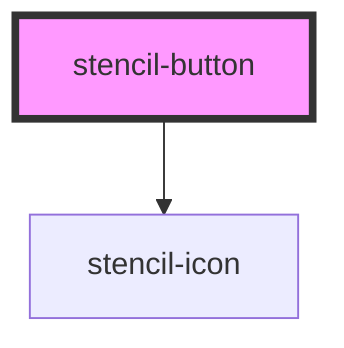

# stencil-button

<!-- Auto Generated Below -->

## Properties

| Property      | Attribute       | Description                                              | Type       | Default     |
| ------------- | --------------- | -------------------------------------------------------- | ---------- | ----------- |
| `icon`        | `icon`          | This property sets icon                                  | `"action"` | `undefined` |
| `isDisabled`  | `is-disabled`   | This property sets button to disabled                    | `boolean`  | `false`     |
| `isIconRight` | `is-icon-right` | This property position icon to left or right             | `boolean`  | `false`     |
| `label`       | `label`         | This property sets label                                 | `string`   | `''`        |
| `size`        | `size`          | This property is to specify size for button e.g. large   | `string`   | `'regular'` |
| `splitIcon`   | `split-icon`    | Controls split button and provides the icon to use       | `"action"` | `undefined` |
| `type`        | `type`          | This property is to specify type for button e.g. primary | `string`   | `'primary'` |

## Events

| Event                | Description                               | Type               |
| -------------------- | ----------------------------------------- | ------------------ |
| `splitButtonClicked` | Emits event  when split button is clicked | `CustomEvent<any>` |

## Dependencies

### Depends on

- [stencil-icon](../stencil-icon)

### Graph

----------------------------------------------

*Built with [StencilJS](https://stenciljs.com/)*
