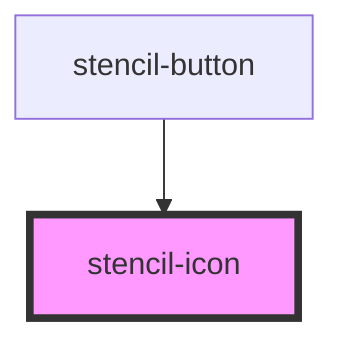

# stencil-icon

<!-- Auto Generated Below -->

## Properties

| Property     | Attribute     | Description                           | Type                                                                                                                                                                                                                                                                                                                                                                                                                                | Default        |
| ------------ | ------------- | ------------------------------------- | ----------------------------------------------------------------------------------------------------------------------------------------------------------------------------------------------------------------------------------------------------------------------------------------------------------------------------------------------------------------------------------------------------------------------------------- | -------------- |
| `isDisabled` | `is-disabled` | Determines if icon is disabled        | `boolean`                                                                                                                                                                                                                                                                                                                                                                                                                           | `false`        |
| `state`      | `state`       | Determines state of icon e.g. primary | `"primary" \| "secondary" \| "non-action" \| "boxed" \| "primary-button" \| "secondary-button" \| "secondary-button-hover" \| "tertiary-button" \| "success" \| "gain" \| "success-alternate" \| "error" \| "loss" \| "alert" \| "warning" \| "informational" \| "new" \| "attention" \| "checkbox" \| "neutral" \| "primary-danger" \| "secondary-danger" \| "tertiary-danger" \| "progress-active" \| "toggle" \| "toggle-hover"` | `'non-action'` |
| `type`       | `type`        | Determines type of icon e.g. settings | `"action"`                                                                                                                                                                                                                                                                                                                                                                                                                          | `undefined`    |

## Dependencies

### Used by

 - [stencil-button](../stencil-button)

### Graph

----------------------------------------------

*Built with [StencilJS](https://stenciljs.com/)*
